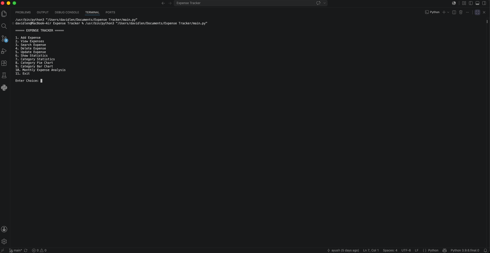
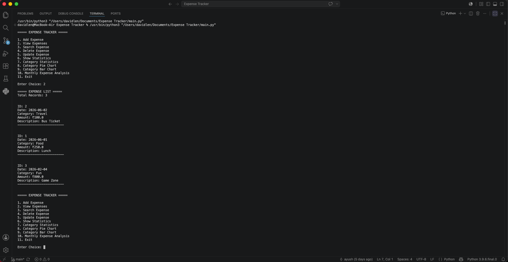
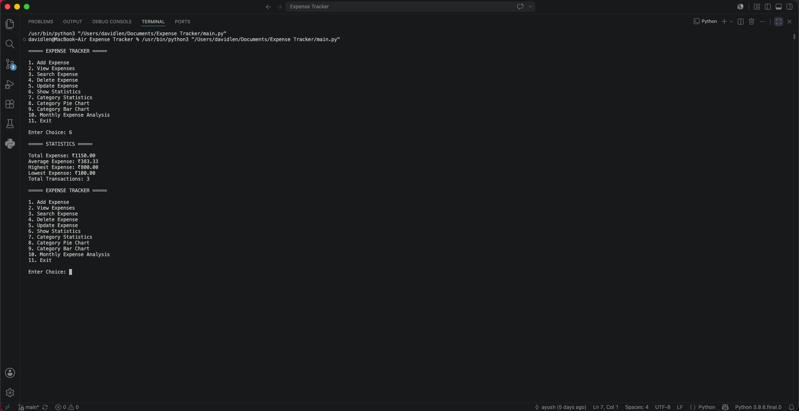
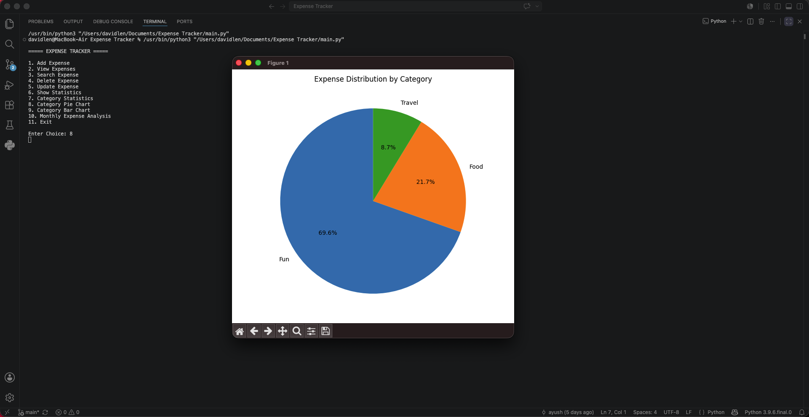

# Expense Tracker

A command-line Expense Tracker built using Python, MySQL, and Matplotlib.

## Features

* Add Expense
* View Expenses
* Search Expense
* Update Expense
* Delete Expense
* Expense Statistics
* Category-wise Statistics
* Expense Distribution Pie Chart
* Category-wise Bar Chart
* Monthly Expense Analysis

## Technologies Used

* Python
* MySQL
* MySQL Connector
* Matplotlib

## Project Structure

```text
Expense Tracker/
│
├── main.py
├── operations.py
├── analytics.py
├── charts.py
├── database.py
├── requirements.txt
├── README.md
├── .gitignore
│
└── screenshots/
```

## Screenshots

### Main Menu



### View Expenses



### Statistics



### Pie Chart



## Installation

1. Clone the repository

```bash
git clone https://github.com/ayushmangal07/expense-tracker-python.git
```

2. Install dependencies

```bash
pip install -r requirements.txt
```

3. Create MySQL database

```sql
CREATE DATABASE EXPENSE_TRACKER;
```

4. Update MySQL credentials in database.py

5. Run the project

```bash
python main.py
```
